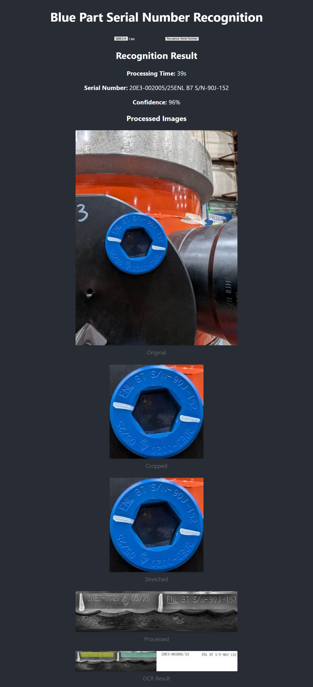

# 项目简介

本项目是一个基于 **React** 和 **Django** 的前后端分离 Web 应用。前端使用 React 实现，后端采用 Django 提供 API 支持，旨在实现高效、可扩展的 Web 服务。

## 技术栈

- 前端：React, JavaScript, HTML, CSS
- 后端：Django, Django REST framework
- 数据库：SQLite
- 图像识别：OpenCV（用于图像处理）
- OCR引擎：本地免费模型（需进一步评估具体模型）
  - PaddleOCR

## 项目结构

```
├── frontend/      # React 前端项目目录
├── backend/       # Django 后端项目目录
├── docs/          # 项目文档目录
  ├── images.zip  # 可用于测试图片
└── README.md      # 项目说明文档
```

## 快速开始

### 1. 克隆项目

```bash
git clone <项目地址>
cd <项目目录>
```

### 2. 安装依赖
1. 安装 python 3.9
2. 安装最新版的 Node.js
3. 点击以下教程，下载并安装 Nginx, 并将本项目的 nginx.conf 文件替换到 nginx 目录下的 conf 目录下
https://blog.csdn.net/weixin_44251179/article/details/129700793

或者，使用以下提示词，给 ChatGPT 安装 nginx
```
你好，我想要在 windows 10/11 下安装 nginx, 作为本地的图片服务器
我有一个现成的 nginx.conf
请你一步一步教我要如何操作，安装 nginx, 并将 nginx.conf 替换到 nginx 目录下的 conf 目录下
直到启动 nginx 服务
```

### 3. 生成Python虚拟环境并启动后端

1. 在 VsCode 中打开新的 Terminal
2. 安装 Python 虚拟环境, 并激活
```
python3.9 -m venv myenv
myenv\Scripts\activate
```
3. 启动后端服务
```bash
cd backend
pip install -r requirements.txt
python manage.py migrate
python manage.py runserver
```

### 4. 启动前端

1. 在 VsCode 中打开新的 Terminal
2. 安装前端依赖
```
npm install
```
3. 启动前端服务
```bash
npm start
```

前端默认运行在 `http://localhost:3000`，后端默认运行在 `http://localhost:8000`。

# 项目截图

