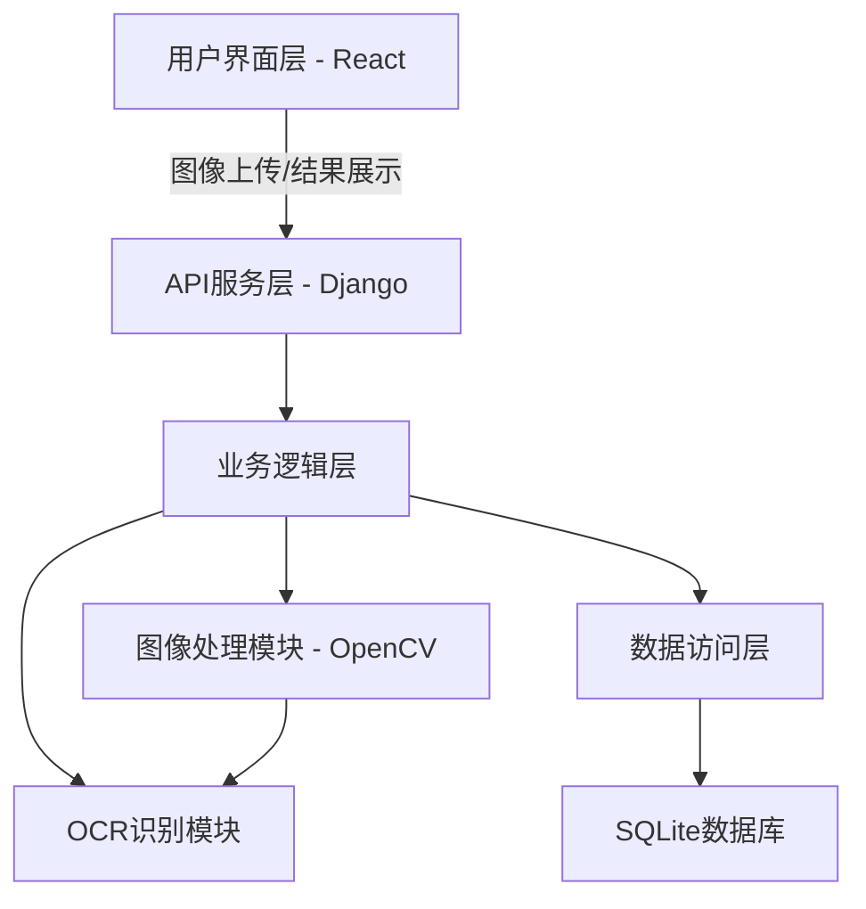
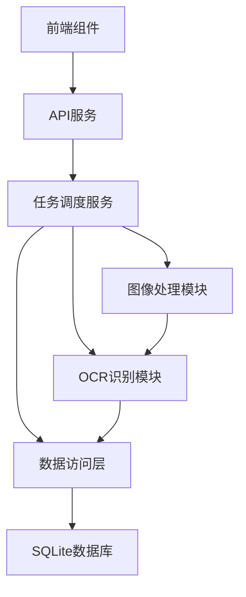
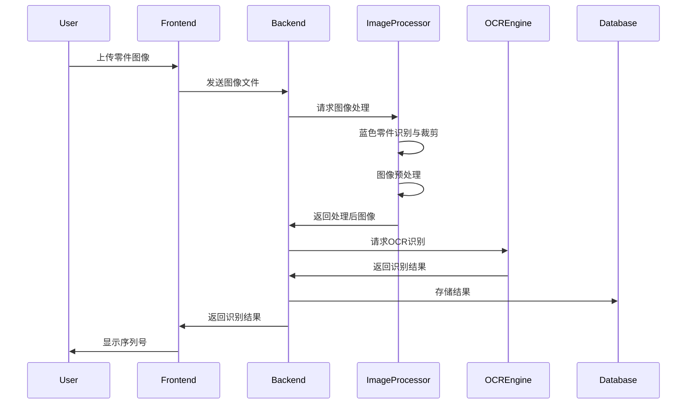

# DESIGN: 蓝色零件序列号识别系统

## 1. 整体架构图



## 2. 分层设计与核心组件

### 2.1 前端层 (React)
- **图像上传组件**：支持拍照/文件选择，适配触控操作
- **图像处理进度展示**：实时反馈处理状态
- **识别结果展示组件**：显示识别的序列号及置信度
- **历史记录查询组件**：查询已存储的识别结果
- **响应式布局**：适配不同尺寸的触控设备

### 2.2 API服务层 (Django)
- **图像接收API**：接收前端上传的图像文件
- **处理状态API**：提供实时处理进度查询
- **结果存储API**：将识别结果保存到数据库
- **结果查询API**：支持按条件查询历史记录
- **认证与授权**：基础的用户验证机制

### 2.3 业务逻辑层
- **任务调度服务**：协调图像处理和OCR识别流程
- **结果验证服务**：检查识别结果的有效性
- **错误处理服务**：统一异常处理和日志记录

### 2.4 核心功能模块

#### 2.4.1 图像处理模块 (OpenCV)
- **蓝色零件识别子模块**：
  - 颜色空间转换 (RGB→HSV)
	- 蓝色阈值过滤
	-轮廓检测与最小外接矩形提取
	- 零件区域裁剪
- **图像预处理子模块**：
	-灰度转换
	-对比度增强
	-噪声去除
	-二值化处理

#### 2.4.2 OCR识别模块
- **文本区域定位**：检测图像中的文本区域
- **字符分割**：将文本区域分割为单个字符
- **字符识别**：使用本地OCR模型识别字符
- **结果后处理**：纠正可能的识别错误

#### 2.4.3 数据访问层
- **识别结果DAO**：数据库操作封装
- **数据模型**：序列号识别结果的数据结构
- **事务管理**：确保数据一致性

## 3. 模块依赖关系图



## 4. 接口契约定义

### 4.1 前端至后端接口

#### 文件上传接口
```
POST /api/upload-image
Content-Type: multipart/form-data
Request: { image: [file] }
Response: {
  task_id: "string",
  status: "processing|completed|failed",
}
```

#### 获取处理结果接口
```
GET /api/get-result/{task_id}
Response: {
  status: "processing|completed|failed",
  result: {
    serial_number: "string",
    confidence: float,
    timestamp: "datetime",
    image_path: "string"
  },
 error: "string"
}
```

### 4.2内部模块接口

#### 图像处理接口
```python
def process_image(image_path: str) -> Tuple[np.ndarray, bool]:
  """
	处理图像并返回裁剪后的零件区域
	Parameters:
	  image_path: 原始图像路径
	Returns:
	  processed_image: 处理后的图像数组
	  success: 处理是否成功
	"""
```

#### OCR识别接口
```python
def recognize_serial_number(image_array: np.ndarray) -> Tuple[str, float]:
	"""
	识别图像中的序列号
	Parameters:
	  image_array: 预处理后的图像数组
	Returns:
	  serial_number: 识别出的序列号
	  confidence: 识别置信度
	"""
```

## 5. 数据流向图



## 6. 异常处理策略

### 6.1 前端异常
- 网络错误：显示重试按钮和错误提示
- 图像格式错误：验证文件类型和大小
- 处理超时：提供取消和重新处理选项

### 6.2 后端异常
- 图像处理失败：记录错误日志，返回友好提示
- OCR识别失败：尝试备用识别算法，降低置信度阈值
- 数据库错误：事务回滚，确保数据一致性

### 6.3 错误码定义
- 1000-1999: 前端错误
- 2000-2999: API错误
- 3000-3999: 图像处理错误
- 4000-4999: OCR识别错误
- 5000-5999: 数据库错误