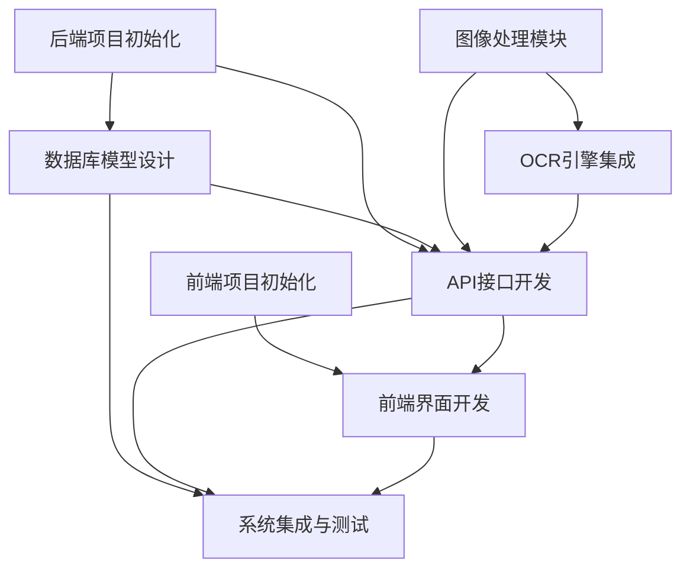

# TASK: 蓝色零件序列号识别系统

## 1. 子任务拆分

### 1.1 前端项目初始化 (T01)
- **输入契约**：
  - 技术栈确认：React
  - 设计规范：简洁触控界面
- **输出契约**：
  - 基础React项目结构
  - 响应式布局框架配置
  - 组件目录结构
- **实现约束**：
  - 使用Create React App搭建
  - 集成触控友好的UI组件库
  - 支持PWA特性（可选）
- **依赖关系**：无前置任务
- **验收标准**：
  - 项目可启动并显示基础页面
  - 适配不同尺寸触控设备

### 1.2 后端项目初始化 (T02)
- **输入契约**：
  - 技术栈确认：Django
- **输出契约**：
  - 基础Django项目结构
  - API目录设计
  - 中间件配置
- **实现约束**：
  - Django REST Framework集成
  - CORS配置
  - 基础异常处理机制
- **依赖关系**：无前置任务
- **验收标准**：
  - 项目可启动
  - 基础健康检查API可访问

### 1.3 数据库模型设计 (T03)
- **输入契约**：
  - 需求文档：识别结果存储需求
  - 后端项目结构
- **输出契约**：
  - SQLite数据库模型定义
  - 数据迁移脚本
  - 基本CRUD操作封装
- **实现约束**：
  - Django ORM实现
  - 包含必要索引
  - 支持数据导出CSV
- **依赖关系**：T02（后端项目初始化）
- **验收标准**：
  - 模型定义符合需求
  - 迁移脚本可执行
  - 基本查询功能正常

### 1.4 图像处理模块开发 (T04)
- **输入契约**：
  - 设计文档：图像处理流程
  - OpenCV库
- **输出契约**：
  - 蓝色零件识别函数
  - 图像预处理函数
  - 单元测试用例
- **实现约束**：
  - Python实现
  - 支持JPG/PNG格式
  - 处理时间<2秒
- **依赖关系**：无前置任务
- **验收标准**：
  - 能正确识别并裁剪蓝色零件
  - 预处理后图像质量满足OCR要求
  - 单元测试覆盖率>80%

### 1.5 OCR引擎集成 (T05)
- **输入契约**：
  - 设计文档：OCR识别需求
  - 预处理后的图像
- **输出契约**：
  - OCR识别函数
  - 置信度评估机制
  - 单元测试用例
- **实现约束**：
  - 使用本地免费OCR模型（如Tesseract）
  - 识别时间<1秒
  - 准确率>80%
- **依赖关系**：T04（图像处理模块）
- **验收标准**：
  - 能识别标准雕刻序列号
  - 输出置信度评分
  - 单元测试覆盖率>80%

### 1.6 API接口开发 (T06)
- **输入契约**：
  - 设计文档：API接口定义
  - 后端项目结构
- **输出契约**：
  - 完整API实现
  - API文档
  - 集成测试用例
- **实现约束**：
  - RESTful设计风格
  - 请求/响应格式标准化
  - 错误处理统一化
- **依赖关系**：
  - T02（后端项目初始化）
  - T03（数据库模型）
  - T04（图像处理模块）
  - T05（OCR引擎）
- **验收标准**：
  - 所有API功能正常
  - API文档完整
  - 集成测试通过

### 1.7 前端界面开发 (T07)
- **输入契约**：
  - 设计文档：UI/UX需求
  - API接口文档
  - 前端项目结构
- **输出契约**：
  - 图像上传界面
  - 处理进度界面
  - 结果展示界面
  - 历史记录界面
- **实现约束**：
  - React组件化开发
  - 触控友好交互设计
  - 响应式布局
- **依赖关系**：
  - T01（前端项目初始化）
  - T06（API接口开发）
- **验收标准**：
  - 所有界面功能正常
  - 适配触控操作
  - 界面响应时间<0.5秒

### 1.8 系统集成与测试 (T08)
- **输入契约**：
  - 所有模块开发完成
  - 测试数据集
- **输出契约**：
  - 集成测试报告
  - 性能测试报告
  - 系统部署脚本
- **实现约束**：
  - 端到端测试覆盖核心流程
  - 性能测试模拟真实场景
- **依赖关系**：
  - T03（数据库模型）
  - T06（API接口）
  - T07（前端界面）
- **验收标准**：
  - 端到端测试通过率>95%
  - 识别准确率>80%
  - 单次识别耗时<3秒

## 2. 任务依赖图

## 3. 并行任务规划

### 3.1 第一阶段（可并行）
- T01（前端项目初始化）
- T02（后端项目初始化）
- T04（图像处理模块）

### 3.2 第二阶段（可并行）
- T03（数据库模型设计）- 依赖T02
- T05（OCR引擎集成）- 依赖T04

### 3.3 第三阶段
- T06（API接口开发）- 依赖T02、T03、T04、T05

### 3.4 第四阶段
- T07（前端界面开发）- 依赖T01、T06

### 3.5 第五阶段
- T08（系统集成与测试）- 依赖T03、T06、T07